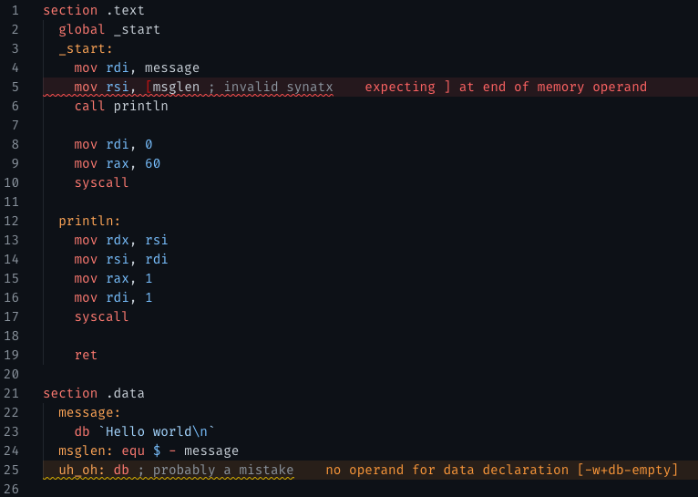

# NASM Language Support

Language features for [NASM Assembly](https://nasm.us/).

## Features

This extension provides syntax highlighting and diagnostics for assembly files (`.asm`, `.nasm`). It can use your system's `nasm` executable to detect compile-time errors and warnings such as invalid syntax or likely incorrect code. It also features auto-indenting to make your code easier to understand.

## Requirements

While syntax highlighting can always be used, you must have a `nasm` binary in your `PATH` to view code diagnostics.

### Getting a NASM binary on Unix-like systems

Your operating system might have a `nasm` package.

For example:

- macOS ([Homebrew](https://brew.sh/)): `brew install nasm`
- Arch Linux: `pacman -S nasm`
- Debian/Ubuntu: `apt-get install nasm`
- Fedora/RPM-based: `dnf install nasm`, `yum install nasm`

### Downloading a NASM binary

You can also download NASM from their [website](https://nasm.us/). Find a link to the latest version and download the binary for your platform. Then, add it to a folder that's in your path, like `/usr/local/bin`.

## Extension Setting
This extension contributes the following settings:

* `nasm.validate`: If enabled, NASM Language Support will validate your assembly files. This is dependent on you having a `nasm` executable in your `PATH`.
* `nasm.outputFormat`: Changes the executable output format to assemble for. This is neccesary to provide correct errors based on your build target.
* `nasm.reportWarnings`: If disabled, validation warnings will be hidden during validation.
* `nasm.extraFlags`: Extra flags (for example, `-w+all`) that will be added add to `nasm` when validating assembly files

## Release Notes

### 1.0.0

- Added syntax highlighting
- Added auto-indentation
- Added LSP server for diagnostics
